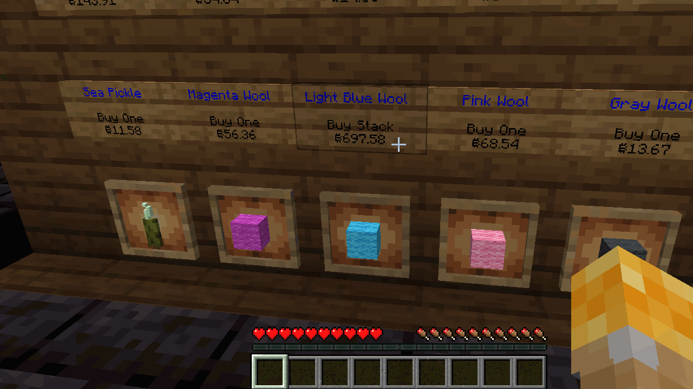

# Fantasy Costco

A Bukkit plugin for minecraft servers that attempts to automatically determine the best prices for various items in the game.

The interface is fairly simple, divided up into dedicated signs for buying and selling items. Left clicking on the signs allows players to change the amount they would like to purchase:

Right clicking on the signs allows players to purchase the amount requested, along with a message indicating how much the sale cost and how much they have left in their wallet:

Left clicking on sell signs also toggles through sell modes, and right clicking on sell signs allows players to sell items:

Players with the `fantasycostco.ordain-sign` permission can enter a mode to "ordain" signs by calling `/ordain true`, which allows them to set signs as sell signs or buy signs by right clicking on them. If the player is holding an item, the sign will be set to a buy sign of that item, otherwise the sign is set to a sell sign. As an added bonus, the plugin automatically
- Sets the sign's first two lines to the item's name, in blue
- Takes care of the automatically formatting the price of the item on the sign
- Adds a glow item frame underneath the sign if it can, with a representation of the item on the sign
- If the glow item frame cannot be added below the sign, the plugin tries to add the frame above the sign

For example:

## Some extra stuff
Some more features:
- Any command which takes `true` as an argument also takes `false`, `get`, `t` as shorhand for `true`, and `f` as shorthand for `false`.
- Players can also pay each other with the `/pay` command, with `/pay [player (name)] [amount (a number)]`
- If a player only wants to know how much it would cost them to buy items, they can crouch+click to get the price without actually buying the items. This can also be done without crouching by calling `/just-looking true`.
- `/wallet` can be called to get the player's current wallet balance.
- If a player wants to purchase a specific amount of items rather than the default amount, they can call `/amount` argument with some quantity. From there, they can buy that exact amount from buy signs in Ideal Price mode. If they want to always override the default amount, they can call `/use-amount true`.
- If a player doesn't care whether they get exactly the amount requested and just wants to get as many as possible even without the funds necessary, they can call `/buy-as-much-as-possible true` (or `/bamp t` for short) to buy as many items as they can afford.

There are some other commands and more advanced features, which can be found either by calling the `/help` command in minecraft or looking through the `plugin.yml` file in `src/main/resources`.

## Caveats
Some caveats:
- Potions are not supported and there are no plans to support them (all potion-related items are supported, however).
- Enchantments are not supported and there are no plans to support them, with the sole exception of Enchanted Books. When selling an enchanted book with multiple items, the plugin will only sell the book for the price of the highest enchantment on the book.
- Creative-only items are not supported and will never be supported, because they cannot be obtained by survival players to sell, and thus balance the price.
- Currently all the math calculations are done with doubles, which means there is some loss of precision. This isn't much problem since we can represent a *ridiculous* amount of money with a double, but it's something to keep in mind.

### How it (kinda) works
Purchasing items from the plugin causes prices to go up (indicative of demand), and selling items causes prices to go down (indicative of supply). The price fluctuates randomly, imitating the stock market, regardless of sales/purchases. Any time a player buys or sells an item, it gets slightly more difficult to move the price of the item, so after enough purchases the price should settle close to some kind of optimal price. Prices are prevented from ever being negative, and netherite items are fixed in price.